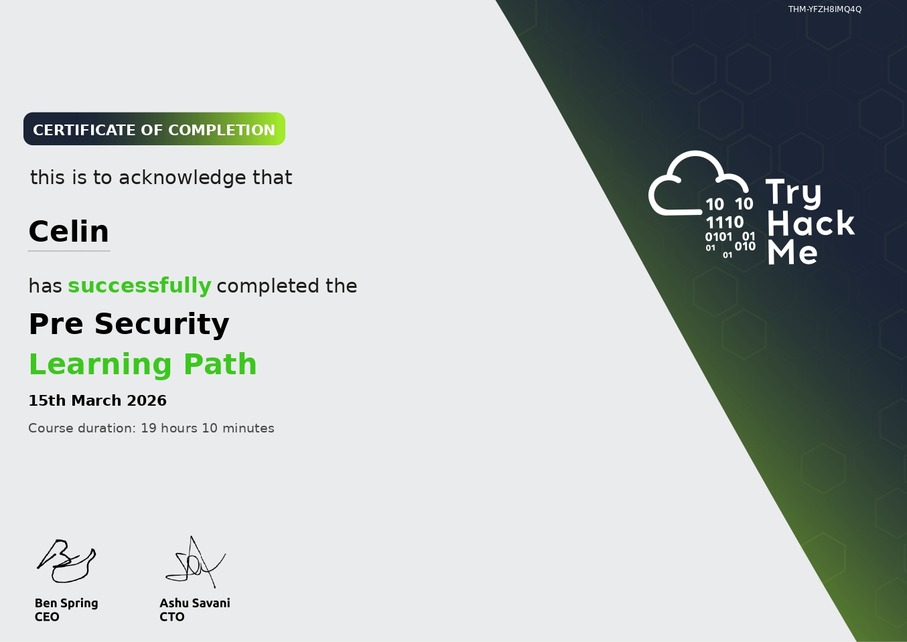

## Hii, I'm Celin ฅ՞•ﻌ•՞ฅ

Learning how systems break so I can understand how to secure them 🔒︎ ༝
- TryHackMe Pre Security Path
[██████████] 100%
- Jr Penetration Tester Path (in progress)
[███░░░░░░░] 30%

## Currently learning:
♡ Ethical Hacking

♡ Pentesting

♡ Linux ( Bash / CLI )

♡ Python ( beginner scripting )

♡ HTML & CSS (foundations)

## Platforms:
♡ TryHackMe

♡ PortSwigger (Web Security Academy)

♡ Youtube

♡ Anything cybersecurity related I can get my hands on

## ⛓ TryHackMe

  

## 🐉 Dragons Slayed

## Experimenting with :
     

